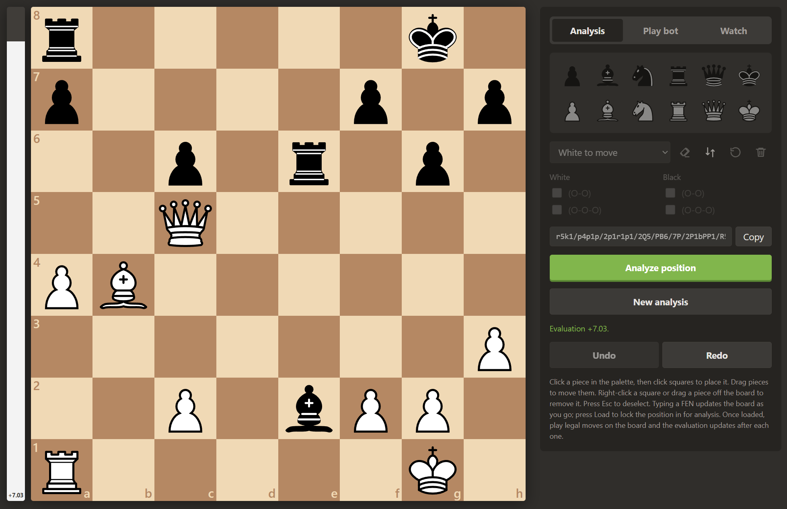
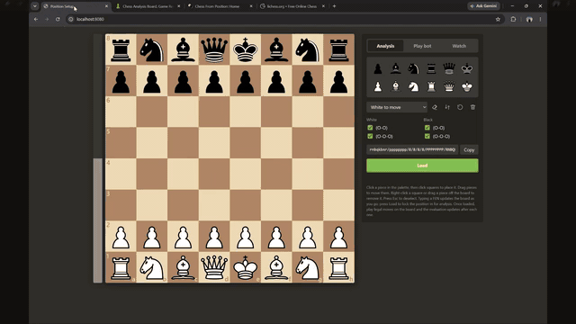

# Chess Position Setup



A chess.com-style position editor: set up a position by dragging or clicking pieces
onto the board, or by pasting a FEN. Choose the side to move and castling rights, then
copy the resulting FEN, or press **Analyze position** to score it with the trained
neural network. The result is shown on an eval bar beside the board, in pawns from
White's point of view (+1.00 = White is a pawn better).

## Demo

[](docs/chess_demo.mp4)

Click the preview for the full video (about 6 minutes): setting up and analyzing a
position in the app, starting the bot with `python lichess_bot.py listen`, and the bot
playing White against Lichess's Stockfish level 5 through to checkmate.

## Run

With Docker (nginx serves `web/`, a second container runs the model behind `/api/`):

```sh
docker compose up --build
```

Open <http://localhost:8080>.

Without Docker, the Python server serves both the page and the model:

```sh
python server.py            # http://localhost:8000
```

Both need a trained checkpoint at `models/chess_eval.pt` (produced by `python -m training.train`).

## Playing on Lichess

`lichess_bot.py` plays games on Lichess as a BOT account, using the same evaluator and
search as the app. Lichess allows engine bots through its official Bot API, so this is
the sanctioned way to put the model up against Stockfish or other bots.

1. Create a fresh Lichess account for the bot (it must have no games played).
2. Create an API token at <https://lichess.org/account/oauth/token/create> with the
   scopes *Play games with the bot API* and *Create, accept, decline challenges*.
3. `export LICHESS_TOKEN=lip_...`
4. `python lichess_bot.py upgrade` (one time, irreversible: the account becomes a BOT).

Then:

```sh
python lichess_bot.py play --ai 3                        # one game vs Lichess Stockfish level 3
python lichess_bot.py play --ai 5 --color black --clock 5+3 --games 3
python lichess_bot.py play --user maia1                  # challenge another bot
python lichess_bot.py resume                             # play games already in progress, then exit
python lichess_bot.py listen                             # play games as they start, accept challenges
```

`--depth` and `--seconds` set the search effort per move; the bot also scales its
thinking time to the clock. Games can be watched live on the bot's Lichess profile.

## API

`POST /api/evaluate` with `{"fen": "<fen>"}` returns
`{"fen": ..., "cp": <centipawns>, "pawns": <cp / 100>}`, clipped to ±2500 cp.
`GET /api/health` reports the loaded checkpoint.

## Usage

- Click a piece in the palette, then click squares to place copies of it. Click the
  same palette piece again (or press Esc) to deselect.
- Drag pieces from the palette or around the board. Drag a piece off the board, or
  right-click it, to remove it.
- Click a piece on the board, then click another square to move it.
- Castling checkboxes are only enabled when the king and the relevant rook are on
  their home squares.
- Paste a FEN into the text box and press Load (or Enter). Only the board field is
  required; side to move and castling are optional and the move counters are ignored.
- The text box always shows the FEN for the current position, without the half-move
  and full-move counters: `<board> <side> <castling> -`.

## Training

Everything under `training/` is run as a module from the repository root:

```sh
python -m training.get_training_data        # sample positions from the Lichess eval dataset -> data/training_data.csv
python -m training.train                    # train on it; writes models/chess_eval.pt (+ _best.pt)
python -m training.evaluate_model           # score a checkpoint on a held-out data/test_data.csv
```

The engine's own command-line checks work the same way: `python -m chess_eval.load_model "<fen>"`
scores positions with the network alone, `python -m chess_eval.search --best "<fen>"` runs the
full search.

## Layout

- `chess_eval/` — the engine as a package: `model.py` (network), `encoding.py` (FEN -> tensors,
  centipawn <-> target mapping), `load_model.py` (checkpoint loading + batch evaluation), `search.py`
  (quiescence + alpha-beta search)
- `training/` — `get_training_data.py`, `train.py`, `evaluate_model.py`
- `server.py` — model inference service and dev web server (`python server.py`)
- `lichess_bot.py` — plays on Lichess as a BOT account using the same search
- `web/` — static site (`index.html`, `style.css`, `app.js`, `fen.js`, `pieces/`, `screenshot.png`);
  `fen.js` is pure FEN parse/serialize logic, loadable under node for testing
- `docker/` — `Dockerfile` (nginx container serving `web/` and proxying `/api/`), `Dockerfile.api`
  (model service, copies only `chess_eval/` and `server.py`), `nginx.conf`
- `docker-compose.yml` — wires the two containers together; build context is the repo root
- `models/` — trained checkpoints; `data/` — datasets and logs (git-ignored)
- `docs/` — demo video and GIF

Piece images are the "cburnett" set from Wikimedia Commons, licensed CC BY-SA 3.0.
